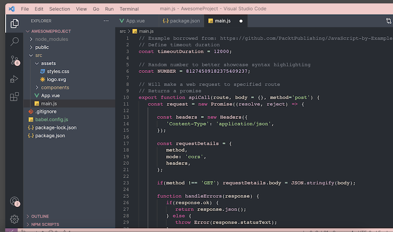
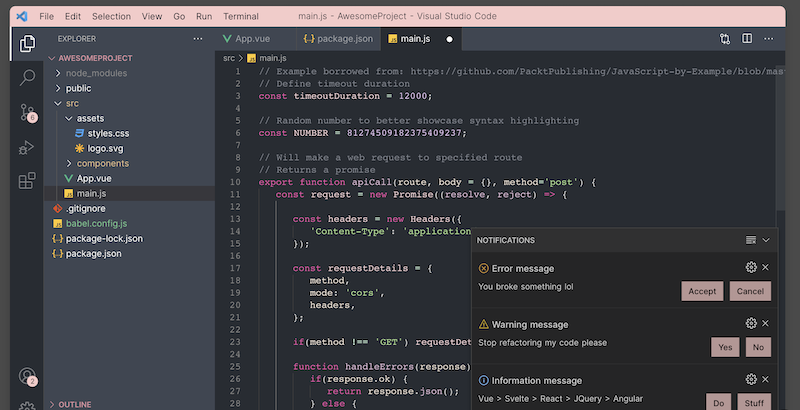
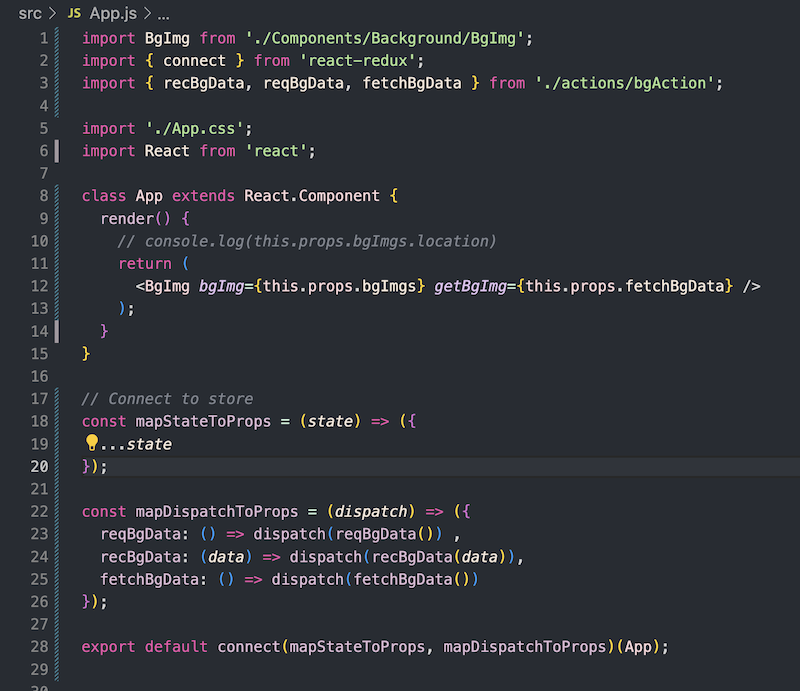

# Pink Panda Theme 🐼

## A Cozy Dark VS Code Theme 

Customize your coding experience with THT's Pink Panda dark theme for VS Code editor. 

Check out how we made it: [How To Create A Custom Visual Studio Code Theme](https://thehelpfultipper.com/create-a-custom-visual-studio-code-theme/)
  

A blend of pastel dark colors contrasted with soft pinks make Pink Panda a pleasure to work with. 
  

  

  

Pink Panda is designed to be easy on the eyes and preserve readability.
  

  

Get yours installed right now! 
  
**Link:** [VS Code Marketplace](https://marketplace.visualstudio.com/items?itemName=TheHelpfulTipper.pinkpanda-dark-theme)

